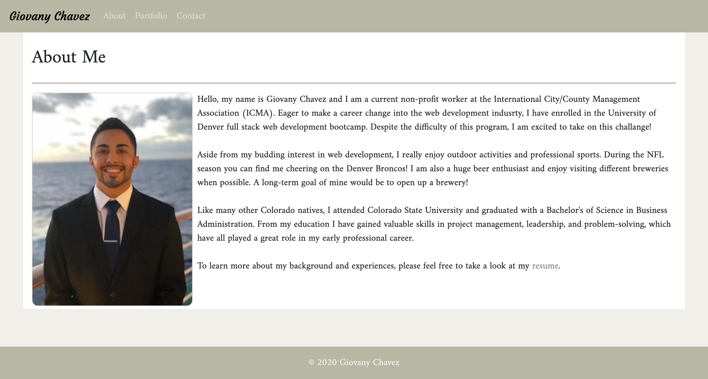
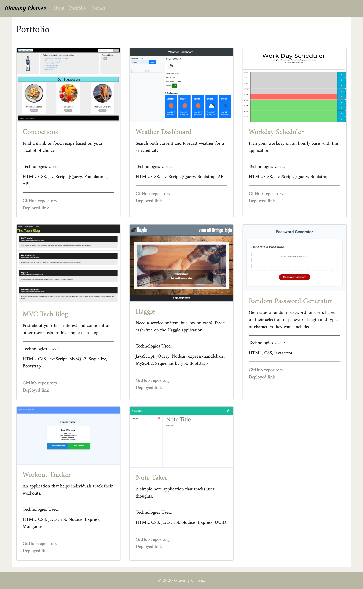
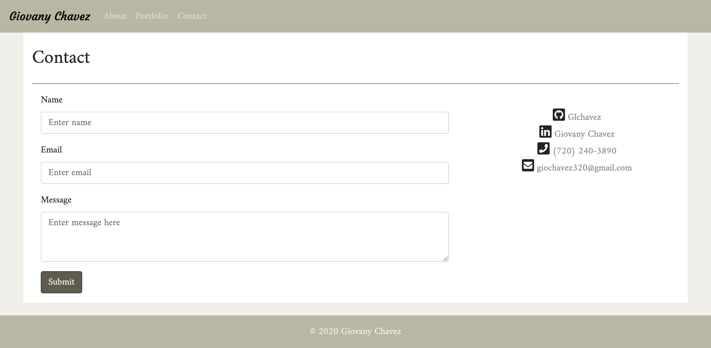

# react-portfolio

This portfolio was created to update my first portfolio by using [Create React App](https://github.com/facebook/create-react-app). This portfolio has an "About Me" page, "Portfolio" page, and "Contact" page. A key update to this portfolio is a functioning contact form.

## Overview

In addition to being a website to display my current projects and knowledge in web development, this portfolio tested my knowledge of React.js.

The website contains an "About Me" page with a short bio of myself, a "Portfolio" page to display my completed projects, and a "Contact" page if anyone desires to reach out. SendGrid was the initial plan to implement a functioning contact form, but that did not work as SendGrid cannot send emails when implemented in a frontend program like React. After research, EmailJS was used to get the contact form working.

I would like to continue editing this website as I learn more about React and implement the powerful tools that React can power.

To view the current website, please click on the following link: [Giovany's Portfolio](https://glchavez.github.io/react-portfolio/)

## Usage

On top of the each web page there is a navigation bar with three links: About, Portfolio, and Contact. When clicked, these links will take you to their respective web pages, as shown in the images below. On the Contact web page, you can fill out the three text boxes to submit a request for contact. This will send an email to me with your information.

## Credits

I would like to provide credit to [The Denver Univeristy Coding Bootcamp](https://bootcamp.du.edu/coding/) for providing me with the materials and intstructions to perform this project.

I would also like to recognize [EmailJS](https://www.emailjs.com/) for providing documents on how to create a form that sends an email when submitted through a React App.

## License

MIT License

Copyright &copy; 2021 Giovany Chavez

Permission is hereby granted, free of charge, to any person obtaining a copy
of this software and associated documentation files (the "Software"), to deal
in the Software without restriction, including without limitation the rights
to use, copy, modify, merge, publish, distribute, sublicense, and/or sell
copies of the Software, and to permit persons to whom the Software is
furnished to do so, subject to the following conditions:

The above copyright notice and this permission notice shall be included in all
copies or substantial portions of the Software.

THE SOFTWARE IS PROVIDED "AS IS", WITHOUT WARRANTY OF ANY KIND, EXPRESS OR
IMPLIED, INCLUDING BUT NOT LIMITED TO THE WARRANTIES OF MERCHANTABILITY,
FITNESS FOR A PARTICULAR PURPOSE AND NONINFRINGEMENT. IN NO EVENT SHALL THE
AUTHORS OR COPYRIGHT HOLDERS BE LIABLE FOR ANY CLAIM, DAMAGES OR OTHER
LIABILITY, WHETHER IN AN ACTION OF CONTRACT, TORT OR OTHERWISE, ARISING FROM,
OUT OF OR IN CONNECTION WITH THE SOFTWARE OR THE USE OR OTHER DEALINGS IN THE
SOFTWARE.